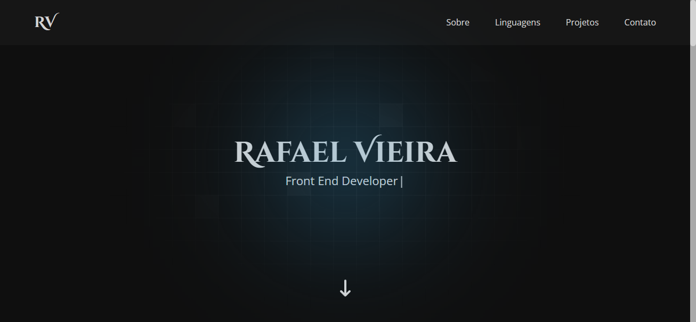
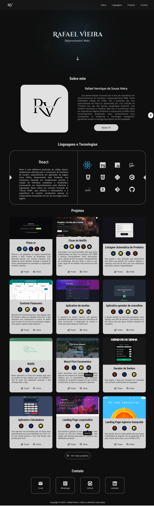

# 📁 Portfolio


<p align="center">
  
</p>

<p align="center">
  <a href="#about">About</a> • 
  <a href="#getting-started">Getting Started</a> • 
  <a href="#routes">Routes</a> • 
  <a href="#contributing">Contributing</a>
</p>

## 📌 About

This is my portfolio as a Frontend Developer, built to showcase selected projects and key skills. It demonstrates modern UI development using **React**, **TypeScript**, **SASS**, and **HTML** with a focus on responsive and dynamic interfaces.

## 🚀 Getting Started

### 🧩 Dependencies

The project uses:

| Package                 | Version  | Function/Description                                    |
| ----------------------- | -------- | ------------------------------------------------------- |
| `@emotion/react`        | ^11.14.0 | Library for styling with CSS-in-JS                      |
| `@phosphor-icons/react` | ^2.1.10  | Reactive vector icons                                   |
| `axios`                 | ^1.8.4   | HTTP client for making requests                         |
| `dayjs`                 | ^1.11.13 | Lightweight date manipulation library                   |
| `npm`                   | ^11.4.2  | Package manager (usually unnecessary in `dependencies`) |
| `react`                 | ^18.3.1  | Main React library                                      |
| `react-animated-cursor` | ^2.11.2  | Animated cursor effect                                  |
| `react-awesome-reveal`  | ^4.3.1   | Animation library using `react-awesome-reveal`          |
| `react-dom`             | ^18.3.1  | DOM renderer for React                                  |
| `react-icons`           | ^5.2.1   | Popular icon packs like FontAwesome, Feather, etc.      |
| `typewriter-effect`     | ^2.21.0  | Animated typewriter text effect                         |

### 📥 Clone the repository

```bash
git clone https://github.com/RafaelHDSV/Portifolio.git
cd Portifolio
npm install || yarn
````

### ▶ Run the project

```bash
npm start || yarn dev
```

## 📍 Routes

| Path | Description |
| - | -- |
| `/`  | Main page   |

### `/` - Main Page

<p>
  
</p>

## 🤝 Contributing

Contributions are welcome and appreciated!  
Please read our [Contributing Guidelines](./CONTRIBUTING.md) to get started.

## 📝 License

This project is licensed under the [MIT License](LICENSE).
