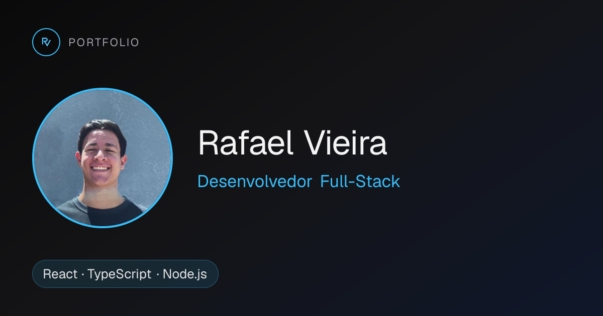
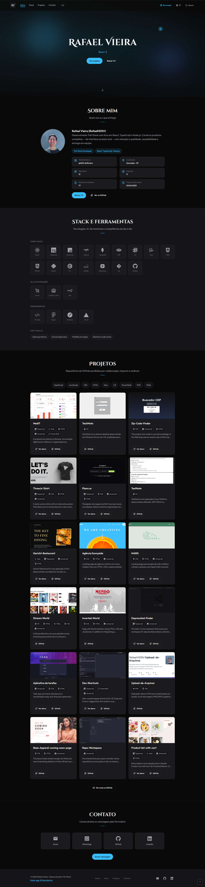

# Portfólio — Rafael Vieira


<p align="center">
  
</p>

<p align="center">
  <strong>Site:</strong> <a href="https://rafaelhdsv.vercel.app">rafaelhdsv.vercel.app</a>
</p>

<p align="center">
  <a href="#sobre">Sobre</a> •
  <a href="#funcionalidades">Funcionalidades</a> •
  <a href="#como-rodar">Como rodar</a> •
  <a href="#scripts">Scripts</a> •
  <a href="#rotas">Rotas</a> •
  <a href="#documentacao">Documentação</a> •
  <a href="#contribuicao">Contribuição</a>
</p>

## Sobre

Portfólio em página única de **Rafael Vieira**, desenvolvedor Full-Stack. Construído com **React 18**, **TypeScript**, **Vite 7** e **SASS**, com i18n PT/EN, tema claro/escuro, projetos alimentados pelo GitHub, formulário de contato (EmailJS), modo recrutador e oito easter eggs para descobrir.

Para arquitetura completa, decisões e histórico de issues, consulte [`docs/context.md`](./docs/context.md).

## Funcionalidades

| Área | Destaques |
|------|-----------|
| **Hero e Sobre** | Headline typewriter, fundo mesh, bio sincronizada com o perfil GitHub |
| **Stack** | Grid responsivo de tecnologias com hover |
| **Projetos** | Pins + repos recentes, filtros multi AND, curadoria híbrida, cards 16:9, skeleton, estado vazio, overlay de stats em touch |
| **Contato** | Cards com hover + formulário em modal (EmailJS) |
| **Modo recrutador** | Deep link `/recruiter`, layout para impressão, `noindex` |
| **i18n** | Português (padrão) e inglês |
| **Tema** | Escuro por padrão, persistido em `localStorage` |
| **SEO** | Imagens OG geradas no build (PT/EN), sitemap, robots, JSON-LD |
| **Easter eggs** | 8 interações ocultas — catálogo no footer (`X/8 descobertos`) |
| **Qualidade** | Testes unitários (Vitest), E2E (Playwright), Lighthouse CI na `main` |

## Como rodar

### Pré-requisitos

- **Node.js 22 LTS** (recomendado; Node 23 pode quebrar o Vitest)
- **Yarn** (lockfile no repositório)

### Variáveis de ambiente

Copie o arquivo de exemplo e preencha as chaves:

```bash
cp .env.example .env
```

| Variável | Uso |
|----------|-----|
| `VITE_GITHUB_ACCESS_TOKEN` | API GitHub (perfil, repos, pins) |
| `VITE_EMAILJS_*` | Formulário de contato (service, template, public key) |
| `VITE_GOOGLE_SITE_VERIFICATION` | Meta tag do Search Console (opcional) |

Nunca faça commit de `.env` com credenciais reais. Veja [`.env.example`](./.env.example).

### Instalar e executar

```bash
git clone https://github.com/RafaelHDSV/Portifolio.git
cd Portifolio
yarn
yarn dev
```

Servidor de desenvolvimento: [http://localhost:5173](http://localhost:5173)

## Scripts

| Comando | Descrição |
|---------|-----------|
| `yarn dev` | Servidor de desenvolvimento (Vite) |
| `yarn build` | Typecheck + geração OG PNG + build de produção |
| `yarn preview` | Preview local do build |
| `yarn lint` | ESLint (zero warnings) |
| `yarn test` | Testes unitários (Vitest) |
| `yarn test:e2e` | E2E com Playwright (build + preview) |
| `yarn test:e2e:ui` | Playwright em modo UI |
| `yarn lhci` | Lighthouse CI (autorun local) |

## Stack

| Camada | Tecnologias |
|--------|-------------|
| UI | React 18, TypeScript, SASS modules, Emotion |
| Build | Vite 7, `@vitejs/plugin-react` |
| i18n | i18next, react-i18next |
| Ícones | Phosphor, react-icons |
| Motion | react-awesome-reveal, typewriter-effect, react-animated-cursor |
| Dados | axios, GitHub REST + GraphQL |
| Contato | EmailJS |
| Imagens OG | `@vercel/og`, Sharp (`scripts/generate-og.ts`) |
| Analytics | `@vieira/analytics` |
| Testes | Vitest, Playwright, Lighthouse CI |

## Rotas

| Caminho | Descrição |
|---------|-----------|
| `/` | Portfólio principal (seções por âncora: Hero, Sobre, Stack, Projetos, Contato) |
| `/recruiter` | Modo recrutador — resumo imprimível, projetos em destaque, `noindex` |

Rewrites de SPA configurados em [`vercel.json`](./vercel.json).

### Preview

<p>
  
</p>

## Easter eggs (sem spoilers)

Oito interações opcionais desbloqueiam entradas no catálogo do footer. Exemplos: código Konami, cliques no logo, alternância rápida de idioma/tema, parâmetro `?mode=vieira` na URL, combinar 3+ filtros de projetos. Nunca bloqueiam conteúdo ou navegação.

Detalhes (incluindo gatilhos): [`docs/context.md`](./docs/context.md).

## Documentação

| Arquivo | Conteúdo |
|---------|----------|
| [`docs/context.md`](./docs/context.md) | Contexto do projeto, estrutura, funcionalidades, env vars |
| [`docs/especificacao-v2-refino-ui-ux.md`](./docs/especificacao-v2-refino-ui-ux.md) | Especificação UI/UX v2 |
| [`docs/google-search-console.md`](./docs/google-search-console.md) | Configuração do Search Console |
| [`docs/emailjs-setup.md`](./docs/emailjs-setup.md) | Configuração do EmailJS |

## Contribuição

Contribuições são bem-vindas. Leia [CONTRIBUTING.md](./CONTRIBUTING.md) antes de abrir um PR.

## Licença

[MIT License](./LICENSE)
